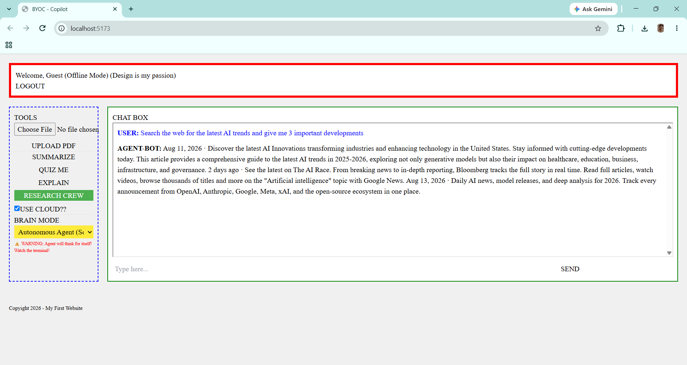

# 🤖 AI Copilot Assistant

An AI-powered personal copilot designed to bring conversational AI, intelligent agents, web search, document understanding and multiple AI workflows into a single web application.

---

## 🚀 Features

- 💬 **AI Chat Assistant** – Ask questions and receive AI-generated responses.
- 🔎 **Web Search** – Search the web for relevant information using DuckDuckGo.
- 🕒 **Current Time Tool** – Provides the current date and time through an AI tool.
- 📄 **PDF Upload & Summarization** – Upload PDF documents and work with their content.
- 🧠 **PDF Reader / RAG Mode** – Retrieve relevant information from uploaded documents.
- 🤖 **Autonomous Agent Mode** – Allows the AI agent to select appropriate tools for a task.
- 👥 **CrewAI Research Crew** – Uses multiple AI agents for research-oriented workflows.
- ☁️ **Cloud LLM Support** – Supports cloud-based LLM access through OpenRouter.
- 💻 **Local LLM Support** – Supports local language models through Ollama.
- 🎛️ **Multiple Brain Modes** – Different AI modes for different types of tasks.

---

## 🏗️ Project Architecture

    AI-Copilot-Assistant/
    │
    ├── backend/
    │   ├── __init__.py
    │   ├── agent.py
    │   ├── crew.py
    │   ├── engine.py
    │   ├── llm_config.py
    │   └── main.py
    │
    ├── frontend/
    │   ├── src/
    │   │   ├── App.jsx
    │   │   ├── firebase.js
    │   │   ├── index.css
    │   │   └── main.jsx
    │   ├── index.html
    │   ├── package.json
    │   ├── package-lock.json
    │   ├── postcss.config.js
    │   ├── tailwind.config.js
    │   └── vite.config.js
    │
    ├── Docs/
    │   └── crewAIDocs.txt
    │
    ├── .env.example
    ├── .gitignore
    ├── GUIDE.md
    ├── README.md
    ├── agent-demo.png
    ├── package-lock.json
    ├── requirements.txt
    ├── setup.sh
    └── visualize_db.py

---

## 🛠️ Tech Stack

### Backend

- Python
- FastAPI
- LangChain
- LangChain Community
- CrewAI

### AI / LLM

- Ollama
- Gemma
- OpenRouter
- LangChain Agents

### Tools & Retrieval

- DuckDuckGo Search
- PDF Processing
- Retrieval-Augmented Generation (RAG)
- Chroma Vector Database

### Frontend

- React.js
- JavaScript
- HTML
- CSS
- Vite
- Node.js
- Firebase

---

## 🧠 AI Capabilities

### PDF Reader / RAG

The application can process uploaded PDF documents and retrieve relevant information to answer questions based on their content.

    Upload PDF
         ↓
    Process Document
         ↓
    Create Embeddings
         ↓
    Store in Vector Database
         ↓
    Retrieve Relevant Content
         ↓
    Generate AI Response

---

### Autonomous Agent

The Autonomous Agent can select and use available tools based on the user's query.

    User Query
        ↓
    AI Agent
        ↓
    Select Appropriate Tool
        ├── Web Search
        └── Current Time
        ↓
    Generate Response

---

### Research Crew

The Research Crew uses multiple AI agents to perform research-oriented tasks and combine their outputs into a final response.

---

## 🤖 Local & Cloud LLM Support

The application supports both local and cloud-based language models.

### Local LLM

Ollama can be used to run supported models locally.

    Application
         ↓
    LangChain
         ↓
    Ollama
         ↓
    Local Gemma Model

### Cloud LLM

OpenRouter provides access to cloud-based models through an OpenAI-compatible API.

    Application
         ↓
    LangChain / OpenAI-compatible API
         ↓
    OpenRouter
         ↓
    Selected LLM

---

## ⚙️ Installation

### 1. Clone the Repository

    git clone https://github.com/anmolshr56/AI-Copilot-Assistant.git
    cd AI-Copilot-Assistant

### 2. Create a Python Virtual Environment

Windows:

    python -m venv venv
    venv\Scripts\activate

### 3. Install Python Dependencies

    pip install -r requirements.txt

### 4. Install Frontend Dependencies

    cd frontend
    npm install
    cd ..

---

## 🔐 Environment Variables

Create a `.env` file in the project root.

Example:

    OPENROUTER_API_KEY=your_openrouter_api_key

> Never upload your real API key or other secrets to GitHub.

The `.env` file should remain ignored by Git.

---

## 🦙 Ollama Setup

For local LLM support, install Ollama and download the required model.

Example:

    ollama pull gemma2:2b

Make sure Ollama is running before using local model functionality.

---

## ▶️ Running the Application

### Start the Backend

From the project root:

    python -m backend.main

### Start the Frontend

Open another terminal:

    cd frontend
    npm run dev

Open the local URL shown by the frontend development server.

---

## 🔄 How It Works

                    ┌───────────────────┐
                    │       User        │
                    └─────────┬─────────┘
                              │
                              ▼
                    ┌───────────────────┐
                    │   AI Copilot UI   │
                    └─────────┬─────────┘
                              │
                              ▼
                    ┌───────────────────┐
                    │    Backend API    │
                    └─────────┬─────────┘
                              │
                ┌─────────────┼─────────────┐
                │             │             │
                ▼             ▼             ▼
           ┌─────────┐   ┌──────────┐   ┌──────────┐
           │ Ollama  │   │OpenRouter│   │  Agents  │
           └─────────┘   └──────────┘   └────┬─────┘
                                             │
                                 ┌───────────┴───────────┐
                                 │                       │
                                 ▼                       ▼
                            Web Search              PDF / RAG

---

## 🎯 Key Learning Areas

This project demonstrates practical implementation of:

- LLM-powered application development
- LangChain workflows
- AI agent architecture
- Tool calling
- Web search integration
- Retrieval-Augmented Generation (RAG)
- PDF document processing
- Local LLM deployment with Ollama
- Cloud LLM integration using OpenRouter
- Multi-agent workflows using CrewAI
- Backend and frontend integration

---

## 🔮 Future Improvements

- 🔐 User authentication
- 💾 Persistent chat history
- 🎙️ Voice input and output
- 📚 Support for additional document formats
- ⚡ Streaming AI responses
- 🧩 More specialized AI agents
- 🌐 Production deployment
- 📊 Usage analytics

---

## 👨‍💻 Author

**Anmol Sharma**

B.Tech CSE Student

GitHub: https://github.com/anmolshr56

---

## 📸 Project Demo

### Autonomous AI Agent with Web Search

The AI Copilot can operate in autonomous agent mode and perform web searches to retrieve up-to-date information.

